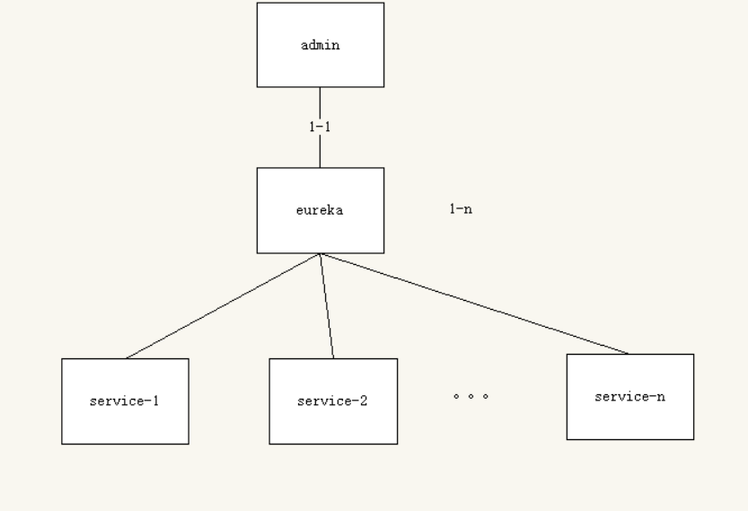
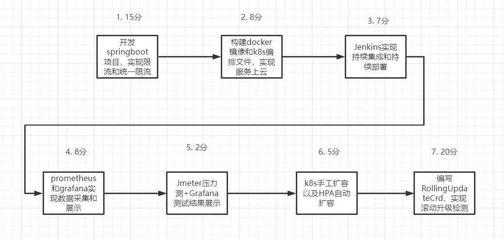
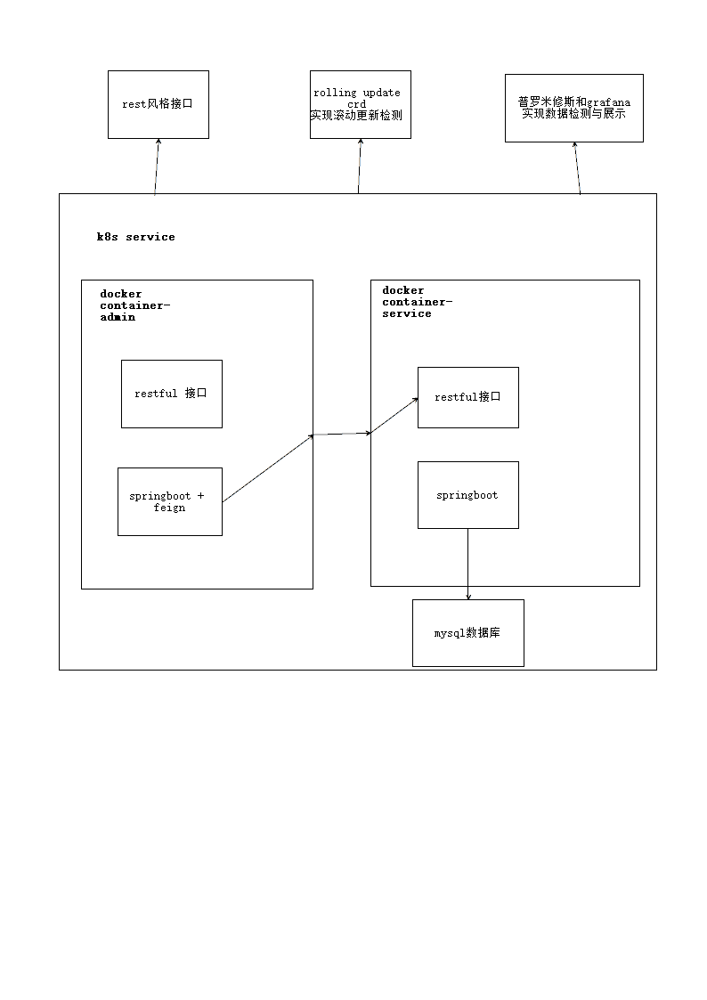

# 概述

在这里我们写一下我们对云原生大作业的理解以及需要用到的技术。

## 内容概览

1. **目的：**开发一个springboot项目，提供一个rest风格接口，并实现限流功能。当有一个服务集群的时候，实现统一限流的功能。

   **方法：**首先springboot项目的开发，没啥好说的。至于接口限流功能，现在暂时打算使用guava提供的限流工具，参见一个[博客](https://blog.csdn.net/linzhiqiang0316/article/details/89393225)， 好不好使我也不知道，还没用过。至于统一限流，现在的想法是使用代理功能，类似于我们的第二次作业。

   

   我们只需要对admin进行限流就可以一次性对所有service限流。

2. **目的：**编写Dockerfile，构建镜像。编写k8s编排文件，创建服务。准备Jenkins持续集成流水线，实现代码构建，单元测试，镜像构建功能。准备Jenkins持续部署流水线，实现部署到k8s集群的功能。

   **方法：**首先编写dockerfile没说的，基础镜像java8，然后运行jar包就可以了。k8s编排文件的写法，还需要想一下，不过和老师提供给第一次作业的两个yaml文件应该很像，我们在这个编排文件里写的大致就是我们的集群需要几个服务等等。Jenkins流水线部署，简单学学就好了，按照他的要求我们写一个Jenkins文件，实现这三个功能就好，至于持续部署，现在还没学，大致办法应该也是Jenkins构建完毕镜像后再加一步，运行k8s编排文件，实现部署。

3. **目的：**提供prometheus(普罗米修斯，火神！)metric接口，实现采集监控数据的功能，然后使用grafana监控大屏，展示采集到的监控数据。使用压测工具对我们在目的1中提供的接口进行压力测试，并将测试结果在grafana展示出来。使用k8s命令手工扩容。编写rolling update crd，用于记录在deployment scale过程中，replicaSet和Pod的变化。利用k8s的HPA模块实现自动扩容。

   **方法：**普罗米修斯还没了解过，简单看一下发现，普罗米修斯能够监测k8s集群的服务数据，然后再和grafana合作展示数据。所以前两个是一个目的，也即收集数据，展示数据，这个我们需要学一下两者的简单使用。然后压力测试工具，推荐的是Jmeter，我们就用它，写一些jmx文件，然后丢到jenkins？还是直接使用，但是直接使用的话普罗米修斯怎么得到数据呢。难办，这个值得好好考虑一下。然后是k8s手工扩容，我们作业1里，由一个服务扩充到两个应该就算手工扩容吧，那还不随随便便。然后是rolling update crd..滚动更新crd。这个好复杂，先贴一篇[文章]([如何从零开始编写一个Kubernetes CRD - 知乎 (zhihu.com)](https://zhuanlan.zhihu.com/p/52367044))，后面的不用看了，因为搜了一下网上的crdController编写方法，又看了一下助教的ppt，准备使用基于go语言的kubebuilder来实现crd。这个很难，但也值很多分。然后是k8s的HPA自动扩容，贴一篇官网[文章]([HorizontalPodAutoscaler 演练 | Kubernetes](https://kubernetes.io/zh-cn/docs/tasks/run-application/horizontal-pod-autoscale-walkthrough/))，看官网的描述，我们只需要输一些命令就可以了，而且老师的要求也是嘴贱的基于cpu负载的扩容，这个蛮简单的。

## 知识点

那总览了一遍，发现我们要学的东西还是蛮多的，不过时间还长，人也多。我们可以慢慢来。

主要知识点有。

1. 接口统一限流
2. jenkins 持续集成持续部署流水线
3. prometheus和grafana配合实现k8s集群数据收集和展示
4. Jmeter和jenkins，grafana合作，展示压力测试的结果。
5. 编写rolling update crd，实现滚动升级监测。
6. HPA自动扩容。

这里的话，最不好写的是3和5，其中5尤为难搞，需要我们来好好琢磨一下。

## 开发流程图

在这里我们画一下，我们开发的整个过程应该怎么进行，以及在各个迭代过程我们要实现什么。



## 系统架构图



## 项目进展说明

### 7.22

到达今天，我们已经将项目部署到k8s集群中了，服务已经正常运行，暴露出的接口分别是

| 服务           | ip地址            |
| -------------- | ----------------- |
| admin-service  | 172.29.4.18:30890 |
| eureka-service | 172.29.4.18:30888 |
| player-service | 172.29.4.18:30881 |

但是这个集群很不稳定，经常掉线，这时候我们需要做的是

```
进入cmd
ssh nju10@172.29.4.18
输入密码 nju102022
然后再多试几次就可以访问成功了
```


这里我们只用了一个player-service1来提供服务，因为k8s提供的deployment可以自动部署多个pod来提供服务，这些pod暴露相同的接口，但是ip地址不一样，和我们的多个service，相同ip不同接口一样，这里我们的接口限流一样工作，无需更改。

```json
pipeline {
  	agent none
    stages {
        stage('Clone Code') {
            agent {
            	label 'master'
        	}
        	steps {
                echo "1.Git Clone Code"
                git url: "https://gitee.com/keep-healthy/cloud-native-h.git"
            }
    	}
        stage('Maven Build') {
            agent {
            	docker {
                    image 'maven:latest'
                    args '-v /root/.m2:/root/.m2'
                }
        	}
            steps {
                echo "2.Maven Build Stage"
                sh 'mvn -B clean package -Dmaven.test.skip=true'
            }
		}
        stage('Image Build') {
            agent {
                label 'master'
            }
            steps {
                echo "3.Image Build Stage"
                sh 'docker build -f Dockerfile --build-arg jar_name=target/player-service1-0.0.1-SNAPSHOT.jar -t player-service1:${BUILD_ID} . '
                sh 'docker tag player-service1${BUILD_ID} harbor.edu.cn/nju10/player-service1:${BUILD_ID}'
            }
        }
        stage('Push') {
            agent {
                label 'master'
            }
            steps {
                echo "4.Push Docker Image Stage"
                sh "docker login harbor.edu.cn -u nju10 -p nju102022"
                sh "docker push harbor.edu.cn/nju10/player-service1:${BUILD_ID}"
            }
        }
	}
}

node('slave') {
    container('jnlp-kubectl') {
        stage('Clone YAML') {
            echo "5. Git Clone YAML To Slave"
            git url: "https://gitee.com/keep-healthy/cloud-native-h.git"
        }
        stage('YAML') {
            echo "6. Change YAML File Stage"
            sh 'sed -i "s#{VERSION}#${BUILD_ID}#g" ./codes/player-service1/player-deploy.yaml'
        }
        stage('Deploy') {
            echo "7. Deploy To K8s Stage"
            sh 'kubectl apply -f ./codes/player-service1/player-deploy.yaml'
        }
    }
}

```

```
ssh nju10@172.29.4.18
cat /home/nju10/.kube/config
```

```
    certificate-authority: /etc/kubernetes/pki/ca.crt
    server: https://172.29.4.20:16443
  name: kubernetes
contexts:
- context:
    cluster: kubernetes
    user: tom
  name: kubernetes
current-context: kubernetes
kind: Config
preferences: {}
users:
- name: tom
  user:
    client-certificate: /etc/kubernetes/pki/nju10.pem
    client-key: /etc/kubernetes/pki/nju10.key
```


```
openssl pkcs12 -export -out cert.pfx -inkey /etc/kubernetes/pki/nju10.key -in /etc/kubernetes/pki/nju10.pem -certfile /etc/kubernetes/pki/ca.crt
```

使用winscp传输cert.pfx文件到本地


```
kubectl get pods -n nju10 -o wide
```


 manage Jenkins - Manage Nodes and Clouds - Configure Clouds

