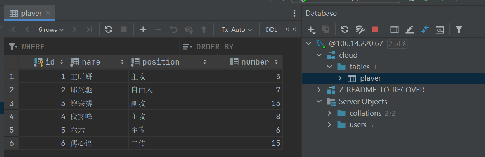
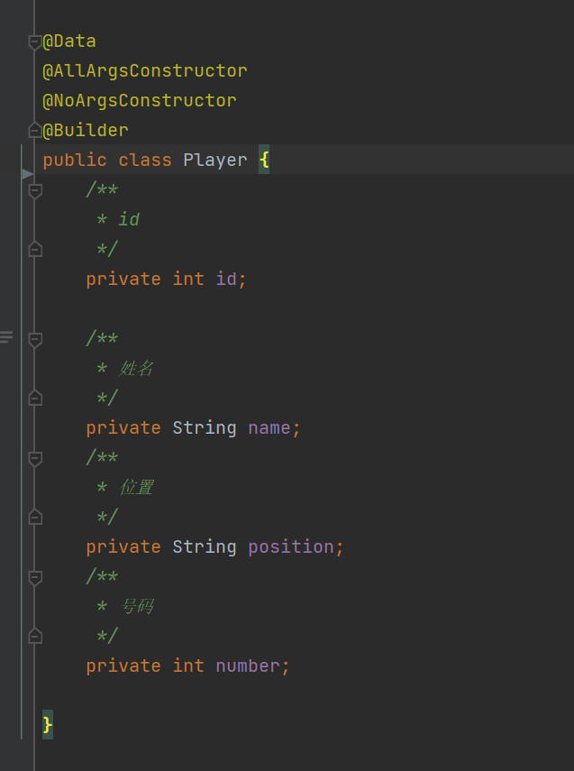
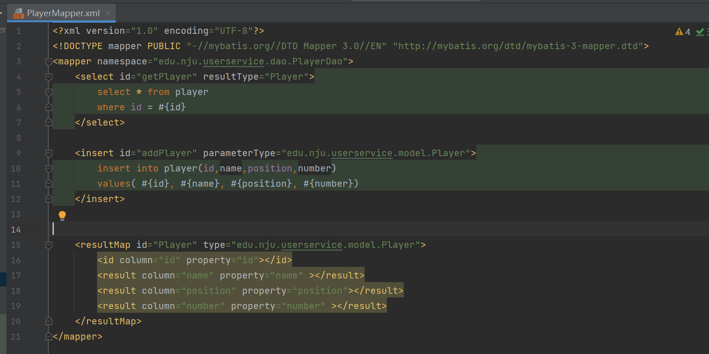
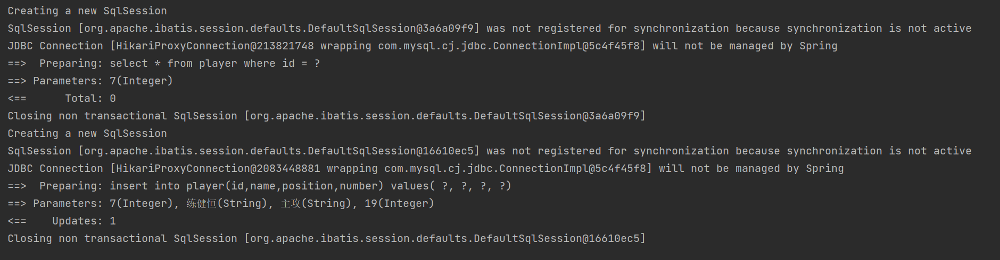
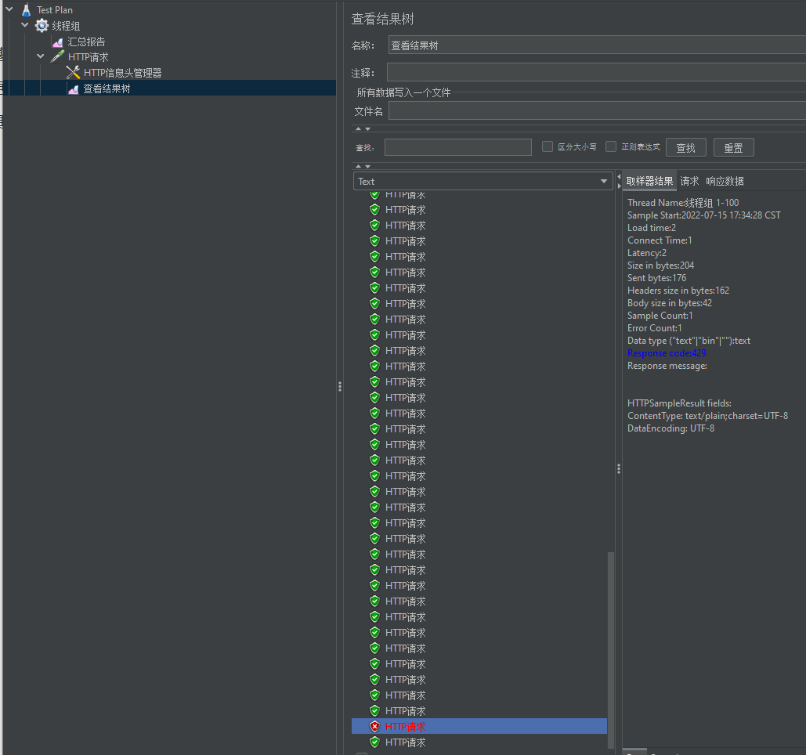
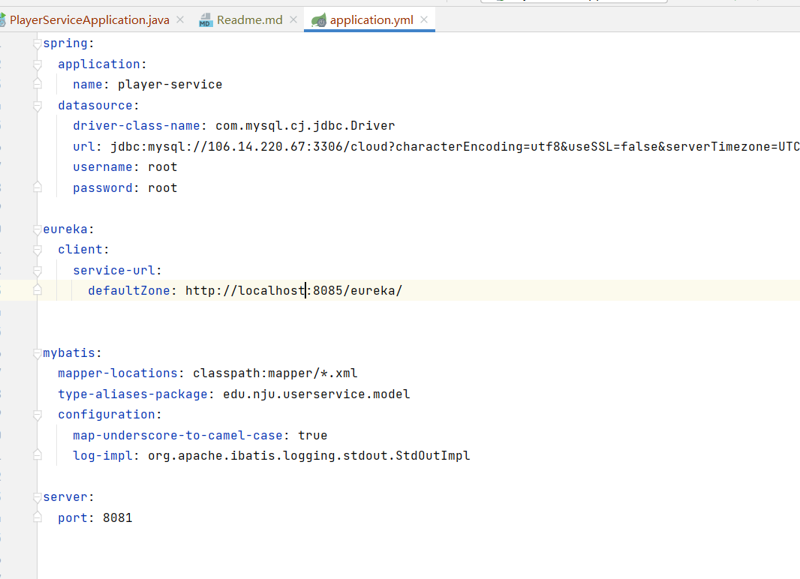
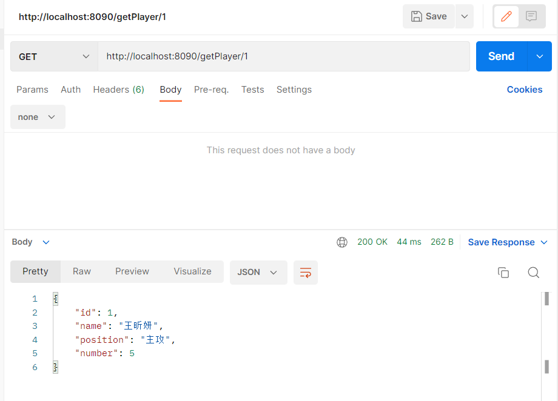
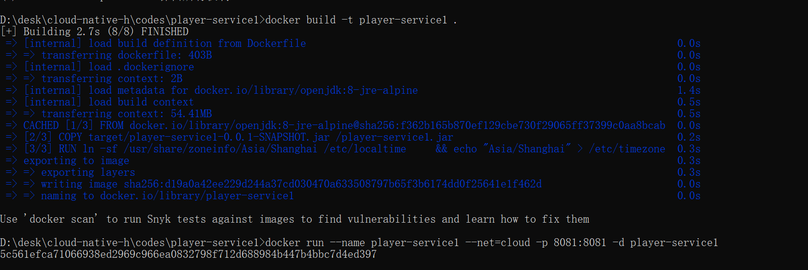
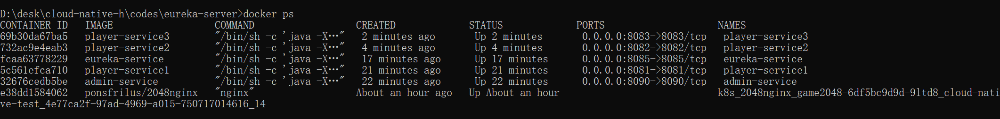
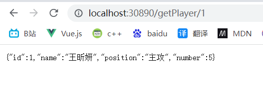

# 基本信息

组号：nju10

| 小组成员 | 学号        |
| ---- | --------- |
| 练健恒  | 201250136 |
| 包泽原  | 201250078 |
| 王慧   | 201250075 |

# 更新记录

这里的版本号说明一下，我们预估有七个版本，分别对应我们的七个迭代过程，每个大版本下面有小版本更新。大版本用小数点前面的表示，小版本用小数点后面的表示。如v3.2表示迭代三的第二个小版本

| 更新日期 | 版本号   | 更新人员 | 更新内容                              |
| ---- | ----- | ---- | --------------------------------- |
| 7.15 | v1.0  | 练健恒  | 初始化springboot项目                   |
| 7.15 | v 1.1 | 王慧   | 实现两个接口                            |
| 7.15 | v1.2  | 包泽原  | 实现接口限流功能                          |
| 7.16 | v1.3  | 练健恒  | 使用eureka实现服务代理和注册                 |
| 7.16 | v1.4  | 包泽原  | 实现集中接口限流功能                        |
| 7.19 | v2.0  | 王慧   | Dockerfile                        |
| 7.22 | v2.1  | 练健恒  | 编写k8s编排文件，手动部署项目到集群，push镜像到harbor |

# 具体更新细节

## Version1

### V1.0

这次更新，练健恒push了springboot项目的基本雏形


### V1.1 Spring Boot项目基础

实现了springboot项目的两个接口addPlayer, getPlayer

#### 1. 项目结构


#### 2. 数据库

##### 2.1 数据库

采用远端数据库连接，数据库的地址是106.14.220.67:3306；数据库cloud中存有table: player。



##### 2.2 实体类



##### 2.3 Mybatis

+ Mybatis配置


+ mapper



#### 3. 逻辑层

##### 3.1 service

+ service接口


+ serviceImpl
  + getPlayer方法对id校验，id非正整数时抛出异常，否则跟据id获取对应数据库中的Player对象。
  + addPlayer方法先判断要添加的Player的id是否重复，是则返回“id已存在”，否则执行添加任务，返回“添加成功”。


##### 3.2 controller

+ controller提供的接口

| 名称                                       | 全限定名                                     | 备注                    |
| ---------------------------------------- | ---------------------------------------- | --------------------- |
| PlayerController.getPlayer(int id)       | public Object getPlayer(@PathVariable int id) | 跟据Player的id获取Player信息 |
| PlayerController.addPlayer(Player player) | public String addPlayer(@RequestBody Player player) | 向数据库中添加一个Player       |


#### 4. postman测试

##### 4.1 测试getPlayer


##### 4.2 测试addPlayer





### V1.2  接口限流功能

#### 1. 使用Guava.RateLimiter包实现接口限流功能

1.1 定义一个GuavaRateLimiterService类，限制每秒最多发送99个请求：

```java
@Service
public class GuavaRateLimiterService {
    /*每秒控制99个许可*/
    RateLimiter rateLimiter = RateLimiter.create(99.0);

    /* 获取令牌*/
    public boolean tryAcquire() {
        return rateLimiter.tryAcquire();
    }

}
```

1.2 在Controller类的方法中添加对于请求流量的判断：

```java
@GetMapping("/getPlayer/{id}")
    public ResponseEntity<Object> getPlayer(@PathVariable int id) {
        if(rateLimiterService.tryAcquire()) {
            return ResponseEntity.status(200).body(playerService.getPlayer(id));
        }
        else return ResponseEntity.status(429).body("{\"code\": 429, \"msg\": \"Too many requests!\"}");
    }
```

#### 2. 使用 Jmeter 进行流量测试

2.1.定义一个线程数为100、ramp-up时间为1秒、循环次数为1的线程组：


2.2 向 http://localhost:8081/getPlayer/1发送请求


2.3 结果如下，可以看到有一个请求返回429Too many requests，其余返回200



### V1.3 eureka实现服务发现

为了实现对接口的统一限流，我们决定采用eureka做服务发现与服务注册，然后使用admin来代理服务，从而是的所有的访问service的服务都要经由admin，进而实现接口统一限流。

使用eureka后，项目的代码结构如下


其中eureka的配置文件如下，他的服务端口是8085


admin的配置文件如下，他的服务端口是8090


三个service的服务端口分别是8081，8082，8083



下图是eureka服务注册后的界面


下图是通过admin调用接口，证明服务拆分成功

### V1.4 集中流控

#### 1.相关代码

将流量控制的逻辑转移到admin-service中，以实现集中流量控制：

adminservice.PlayerController

```java
public class PlayerController
{
    @Autowired
    private final PlayerService playerService;
    @Autowired
    private final GuavaRateLimiterService rateLimiterService;

    public PlayerController(PlayerService playerService, GuavaRateLimiterService rateLimiterService) {
        this.playerService = playerService;
        this.rateLimiterService = rateLimiterService;
    }

    @GetMapping("/getPlayer/{id}")
    public ResponseEntity<Object> getPlayer(@PathVariable int id)
    {
        if(!rateLimiterService.tryAcquire()) {
            return ResponseEntity.status(429).body("{\"code\": 429, \"msg\": \"Too many requests!\"}");
        }
        return playerService.getPlayer(id);
    }

   ...
}
```

adminService.GuavaRateLimiterService

```java
public class GuavaRateLimiterService {

    /*每秒控制99个许可*/
    RateLimiter rateLimiter = RateLimiter.create(99.0);

    /**
     * 获取令牌
     */
    public boolean tryAcquire() {
        return rateLimiter.tryAcquire();
    }
}
```

playerService 仅实现数据获取功能

playerService.PlayerController

```java
public class PlayerController {

    private final PlayerService playerService;

    @Autowired
    public PlayerController(PlayerService playerService){
        this.playerService = playerService ;
    }

    @GetMapping("/getPlayer/{id}")
    public ResponseEntity<Object> getPlayer(@PathVariable int id) {
        return ResponseEntity.status(200).body(playerService.getPlayer(id));
    }
	
    ...
}
```

#### 2. 使用 Jmeter 进行流量测试

限定每秒流量数为10，即

```java
 RateLimiter rateLimiter = RateLimiter.create(10.0);
```

定义一个线程数为15、ramp-up时间为1秒、循环次数为1的线程组：


向 http://localhost:8090/getPlayer/1发送Get请求：


查看结果树可以看到，有10个请求成功发送，15-10=5个请求的状态码为429，这与预期相符：


查看3个playerService, 发现player-service1处理了4次请求，player-service2和player-service3均处理了3次请求，（4+3+3=10）


## Version 2

### V2.0 Dockerfile

#### 1. Dockerfile

为eureka-server, admin-service, player-service1, player-service2, player-service3 编写Dockerfile, 用于构建镜像。

##### 1.1 eureka-server


##### 1.2 admin-service


##### 1.3 player-service


#### 2. 构建镜像并运行

在对eureka-server, admin-service, player-service分别mvn打包后，先后构建镜像，然后创建一个名为cloud的网络，将五个服务在这个网络下启动。同时为了能够使得容器间能够通信，修改admin-service, player-service的defaultZone的配置为

```
eureka:
  client:
    service-url:
      defaultZone: http://eureka-service:8085/eureka/
```

##### 2.1 创建cloud网络


##### 2.2 构建镜像并运行

+ eureka-server


+ admin-service


+ player-service

  

  


##### 2.3 测试结果

+ docker ps 查看运行容器



+ 访问localhost:8085 


+ 测试接口功能


### V2.1 push镜像到harbor仓库，编写k8s编排文件，部署项目到集群

#### push镜像到harbor仓库

由于我们本地是windows系统，配置docker安全连接地址时不容易，于是我们选择使用了一台linux虚拟机来进行镜像push


首先我们设置安全连接，允许以http协议登录到harbor


然后设置dns映射，将harbor.edu.cn映射到172.29.4.26


然后使用账号密码的方式登录harbor


然后给本地镜像打标签


打完标签后推送到远程仓库


推送成功，看到harbor仓库中已经存在镜像


#### 编写k8s编排文件

为了启动项目，我们首先将项目运行为deployment，使得能够自动扩容，便于管理


然后为了能让外界访问到项目，我们将项目部署为NodePort的service，这样项目之间彼此可以通过服务名访问


其他两个服务的yml文件如下


然后我们现在本地的k8s运行，看到pods运行成功


访问服务发现可以正常运行




#### 手动部署项目到集群

首先我们使用winscp将yml文件传送到集群中


然后我们以ssh协议登录到k8s集群


然后应用这些yml文件，deployment和service都运行成功, 查看pod运行成功


然后访问服务，运行成功


